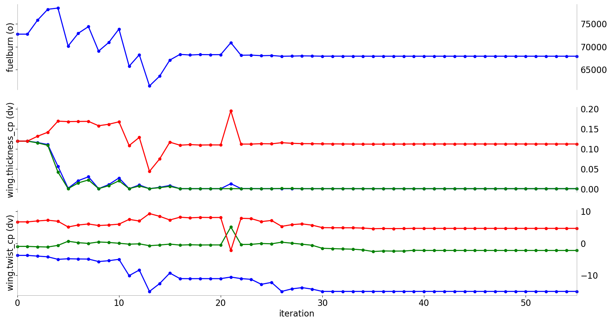

pyOptSparse - PYthon OPTimization (Sparse) Framework
====================================================

[](https://travis-ci.org/OpenMDAO/pyoptsparse)
[](https://coveralls.io/github/OpenMDAO/pyoptsparse?branch=master)

pyOptsparse is an object-oriented framework for formulating and solving nonlinear constrained optimization problems in an efficient, reusable, and portable manner.
It evolved from pyOpt through the usage of sparse matrices throughout the code.
Many optimization techniques can be used in pyOptSparse, including SNOPT, IPOPT, SLSQP, NSGA2, and more.
A visualization tool called OptView also comes packaged with pyOptSparse, which shows the optimization history through an interactive GUI.
An example output from OptView is shown below.



Documentation
-------------

Please see the [documentation](http://mdolab.engin.umich.edu/docs/packages/pyoptsparse/doc/index.html) for installation details and API documentation.

To locally build the documentation, enter the `doc` folder and enter `make html` in terminal.
You can then view the built documentation in the `_build` folder.

Citation
--------

Please cite pyOpt and the authors of the respective optimization
algorithms in any publication for which you find it useful.
For more background, theory, and figures, see the [pyOptSparse journal article](http://mdolab.engin.umich.edu/sites/default/files/pyOpt.pdf).

Perez, R. E., Jansen, P. W., and Martins, J. R. R. A., “pyOpt: A Python-Based Object-Oriented Framework for Nonlinear
Constrained Optimization,” Structural and Multidisciplinary Optimization, Vol. 45, No. 1, January 2012, pp. 101–118.
doi:10.1007/s00158-011-0666-3.

```
@article{Perez2012a,
	Author = {Ruben E. Perez and Peter W. Jansen and Joaquim R. R. A. Martins},
	Doi = {10.1007/s00158-011-0666-3},
	Journal = {Structural and Multidisciplinary Optimization},
	Month = {January},
	Number = {1},
	Pages = {101--118},
	Title = {{pyOpt}: A {Python}-Based Object-Oriented Framework for Nonlinear Constrained Optimization},
	Volume = {45},
	Year = {2012},
	Annote = {10.1007/s00158-011-0666-3}}
```

License
-------

Copyright 2019 MDO Lab. See the LICENSE file for details.
