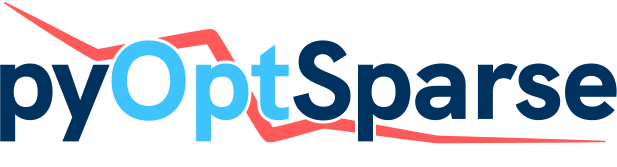

<h2 align="center">
    
</h2>

[](https://anaconda.org/conda-forge/pyoptsparse)
[](https://dev.azure.com/mdolab/Public/_build/latest?definitionId=29&branchName=main)
[](https://mdolab-pyoptsparse.readthedocs-hosted.com/en/latest/?badge=latest)
[](https://codecov.io/gh/mdolab/pyoptsparse)
[](https://github.com/psf/black)
[](https://doi.org/10.21105/joss.02564)

pyOptSparse is an object-oriented framework for formulating and solving nonlinear constrained optimization problems in an efficient, reusable, and portable manner.
It is a fork of pyOpt that uses sparse matrices throughout the code to more efficiently handle large-scale optimization problems.
Many optimization techniques can be used in pyOptSparse, including both gradient-based and gradient-free methods.
A visualization tool called OptView also comes packaged with pyOptSparse, which shows the optimization history through an interactive GUI.
An example output from OptView is shown below.


## Optimizer support
pyOptSparse provides Python interfaces for a number of optimizers.
ALPSO, CONMIN, IPOPT, NLPQLP, NSGA2, PSQP, SLSQP, ParOpt and SNOPT are currently tested and supported.

We do not provide the source code for SNOPT and NLPQLP, due to their restrictive license requirements.
Please contact the authors of the respective optimizers if you wish to obtain them.
Furthermore, ParOpt and IPOPT are available as a open source package but must be installed separately.
Please see the documentation page of each optimizer for purchase and installation instructions.

## Integration into other frameworks
pyOptSparse can be used in the following optimization frameworks:
- [MACH-Aero](https://github.com/mdolab/MACH-Aero)
- [OpenMDAO](https://openmdao.org) and by extension [OpenAeroStruct](https://github.com/mdolab/openaerostruct)
- [SUAVE](https://suave.stanford.edu)

## Documentation
Please see the [documentation](https://mdolab-pyoptsparse.readthedocs-hosted.com/) for installation details and API documentation.

## Testing
Testing is done with the `testflo` package developed by the openMDAO team, which can be installed via `pip install testflo`.
To run the tests, simply type `testflo .` in the root directory.

## Building From Source in a Conda Environment
The build instructions with the new meson build system are the same as before, using setuptools as the backend with the exception that
`numpy` is no longer needed before running `pip install .`, it is installed as build dependency like everything else. Only
`setuptools` and `pip` are required prior and of course appropriate compilers for your platform

Building from a conda environment is slightly different as all the build dependencies are expected to be in the conda
environment unless there is no package available for it. Since the `pip install .` method does dependency checks on packages
that don't necessarily match the names in a conda environment it will try to download deps from PyPi or just flat out fail.

So the build and install for a conda environment is:
```shell
# Setup env
## OSX/Linux
conda env create -n pyos-build -f environment.yml
## Windows
conda env create -n pyos-build -f win-environment.yml

# activate
conda activate pyos-build

# point to ipopt
## OSX/Linux
export IPOPT_DIR="$CONDA_PREFIX"
## Windows
set IPOPT_DIR=%CONDA_PREFIX%

# build wheel
python -m build -n -x .

# install wheel
pip install --no-deps --no-index --find-links dist pyoptsparse
```

Note that for Windows, it is expected that Visual Studio 2017 C/C++ Build Tools are installed before running the above 
commands.

## Citation
If you use pyOptSparse, please see [this page](https://mdolab-pyoptsparse.readthedocs-hosted.com/en/latest/citation.html) for citation information.
A list of works that have used pyOptSparse can be found [here](https://mdolab-pyoptsparse.readthedocs-hosted.com/en/latest/citation.html#applications)

## License
pyOptSparse is licensed under the GNU Lesser General Public License.
See `LICENSE` for the full license.

## Copyright
Copyright (c) 2011 University of Toronto\
Copyright (c) 2014 University of Michigan\
Additional copyright (c) 2014 Gaetan K. W. Kenway, Ruben Perez, Charles A. Mader, and\
Joaquim R. R. A. Martins\
All rights reserved.
